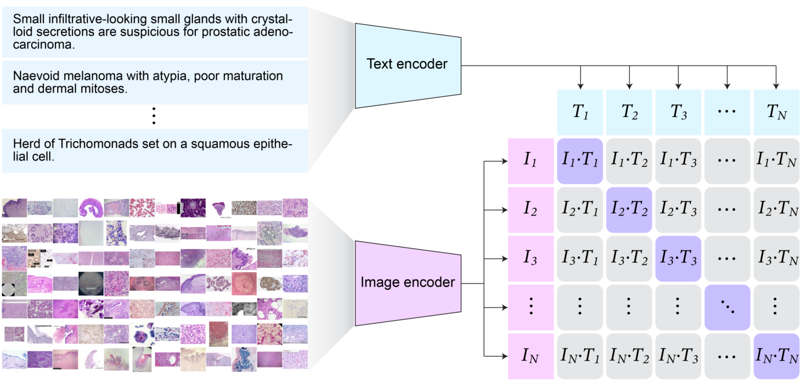

# Pathology Language and Image Pre-Training (PLIP)

Pathology Language and Image Pre-Training (PLIP) is the first vision and language foundation model for Pathology AI. PLIP is a large-scale pre-trained model that can be used to extract visual and language features from pathology images and text description.
The model is a fine-tuned version of the original CLIP model.





## Resources
- 📚 [Official Demo](https://huggingface.co/spaces/vinid/webplip)
- 📚 [PLIP on HuggingFace](https://huggingface.co/vinid/plip)
- 📚 [Paper](https://www.nature.com/articles/s41591-023-02504-3)


### Internal API Usage

```python
    from plip.plip import PLIP
    import numpy as np
    
    plip = PLIP('vinid/plip')
    
    # we create image embeddings and text embeddings
    image_embeddings = plip.encode_images(images, batch_size=32)
    text_embeddings = plip.encode_text(texts, batch_size=32)
    
    # we normalize the embeddings to unit norm (so that we can use dot product instead of cosine similarity to do comparisons)
    image_embeddings = image_embeddings/np.linalg.norm(image_embeddings, ord=2, axis=-1, keepdims=True)
    text_embeddings = text_embeddings/np.linalg.norm(text_embeddings, ord=2, axis=-1, keepdims=True)
```

### HuggingFace API Usage

```python

    from PIL import Image
    from transformers import CLIPProcessor, CLIPModel
    
    model = CLIPModel.from_pretrained("vinid/plip")
    processor = CLIPProcessor.from_pretrained("vinid/plip")
    
    image = Image.open("images/image1.jpg")
    
    inputs = processor(text=["a photo of label 1", "a photo of label 2"],
                       images=image, return_tensors="pt", padding=True)
    
    outputs = model(**inputs)
    logits_per_image = outputs.logits_per_image  # this is the image-text similarity score
    probs = logits_per_image.softmax(dim=1)  
    print(probs)
    image.resize((224, 224))

```

### Citation

If you use PLIP in your research, please cite the following paper:

```bibtex
    @article{huang2023visual,
    title={A visual--language foundation model for pathology image analysis using medical Twitter},
    author={Huang, Zhi and Bianchi, Federico and Yuksekgonul, Mert and Montine, Thomas J and Zou, James},
    journal={Nature Medicine},
    pages={1--10},
    year={2023},
    publisher={Nature Publishing Group US New York}
}
```

### Acknowledgements

The internal API has been **copied** from FashionCLIP.